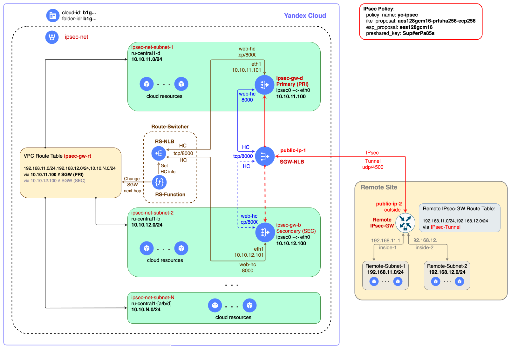

# Развёртывание отказоустойчивого IPsec шлюза в Yandex Cloud

Оглавление:

* [Введение](#overview)
* [Топология развертывания](#topology)
* [Требования к облачным ресурсам](#resources)
* [Подготовка к развёртыванию](#prep)
* [Развёртывание отказоустойчивого IPsec шлюза](#deploy)

## Какую задачу решаем <a id="overview"/></a>

Развернуть **отказоустойчивый** IPsec шлюз (`IPsec HA Gateway`) для организации сетевой IP-связности между ресурсами в `Yandex Cloud` и ресурсами на удаленной площадке.

Примечания:
1. В данном развертывании используется образ [IPsec Container Instance](https://yandex.cloud/marketplace/products/yc/ipsec-container-instance) из Yandex Cloud Marketplace.
2. Для реализации отказоустойчивости в данном развертывании используется модуль [Route-Switcher](https://github.com/yandex-cloud-examples/yc-route-switcher).

## Топология развертывания <a id="topology"/></a>

Типовая схема развертывания `IPsec HA Gateway` в Yandex Cloud показана на схеме ниже.

<p align="left">
    
</p>


## Описание работы решения <a id="details"/></a>

Отказоустойчивость в данном развертывании строится по схеме `Active-Standby` (основная и резервная ВМ). Сетевой трафик всегда передается через основную ВМ.

Движение трафика в системе происходит следующим образом:

* Удаленный IPsec шлюз `Remote IPsec-GW` отправляет IPsec трафик от своего IP-адреса `public-ip-2` на публичный IP-адрес `public-ip-1`, который привязан к [обработчику трафика](https://yandex.cloud/docs/network-load-balancer/concepts/listener) на [внешнем NLB](https://yandex.cloud/docs/network-load-balancer/concepts/nlb-types) `SGW-NLB`.

* У NLB есть [группа целевых ресурсов](https://yandex.cloud/docs/network-load-balancer/concepts/target-resources), в которую входят две ВМ `ipsec-gw-d` и `ipsec-gw-b`, развернутые в разных [зонах доступности](https://yandex.cloud/docs/overview/concepts/geo-scope) (в разных подсетях одной сети VPC). Одна из ВМ является основной (primary - PRI), другая резервной (secondary - SEC). 

* Весь входящий трафик от NLB направляется всегда на одну из двух ВМ. Изначально это основная ВМ `ipsec-gw-d`. Такое распределение трафика обеспечивается использованием [групп безопасности](https://yandex.cloud/docs/vpc/concepts/security-groups), которые применяются на сетевых интерфейсах `eth0` виртуальных машин. Группы безопасности разрешают прохождение трафика от [подсистемы проверок доступности ресурсов](https://yandex.cloud/docs/network-load-balancer/concepts/health-check) балансировщика для основной ВМ и запрещают эти проверки для резервной ВМ `ipsec-gw-b`. В случае переключения трафика с основной ВМ на резервную, группы безопасности на сетевом интерфейсе `eth0` ВМ также меняются местами.

* Исходящий трафик от облачных ресурсов в подсетях `ipsec-net-subnet-1`, `ipsec-net-subnet-2` и т.д. к ресурсам в подсетях удаленной площадки, с помощью [таблицы маршрутизации VPC](https://yandex.cloud/docs/vpc/concepts/routing#rt-vpc) `ipsec-gw-rt` будет направляться через основную в ВМ (`ipsec-gw-d`).

* Для обеспечения прохождения проверок доступности со стороны балансировщика `SGW-NLB` в составе каждой из ВМ есть контейнер `web-hc` с web-сервером `nginx` внутри, который отвечает на запросы проверок доступности по заданному в конфигурации TCP порту (`tcp/8000`).

Переключением IPsec трафика с основной ВМ на резервную, в случае отказов, занимается модуль [Route Switcher](https://github.com/yandex-cloud-examples/yc-route-switcher), который выполняет следующие действия:

* Постоянно отслеживает состояние активной и резервной виртуальных машин на порту `tcp/8000` с периодичностью примерно `10s` (задается в конфигурации модуля Route-Switcher). Для взаимодействия с модулем Route-Switcher на основной и резервной ВМ создается отдельный сетевой интерфейс `eth1`.

* При отказе основной `ВМ`, `Route-Switcher` выполняет следующие действия:
   * меняет местами группы безопасности на сетевом интерфейсе `eth0` у основной и резервной ВМ, переключая таким образом, входящий IPsec трафик с основной на резервную ВМ `ipsec-gw-b`.
   * изменяет адрес шлюза (next-hop) в таблице маршрутизации `ipsec-gw-rt` для всех префиксов подсетей на ip-адрес интерфейса `eth0` резервной ВМ - `10.10.12.100`.
   * при возвращении основной ВМ в рабочее состояние, модуль Route-Switcher возвращает трафик на нее и перенастраивает таблицу маршрутизации на next-hop основной ВМ `10.10.11.100`. Данное поведение можно изменить в параметрах модуля.


## Требования к облачным ресурсам <a id="resources"/></a>

Развертывание `IPsec HA Gateway` предполагается в уже существующей инфраструктуре Yandex Cloud. Перед началом развёртывания необходимо убедиться, что в вашей облачной инфраструктуре в Yandex Cloud уже созданы следующие ресурсы:
* [Облако](https://yandex.cloud/docs/resource-manager/operations/cloud/create)
* [Каталог облачных ресурсов](https://yandex.cloud/docs/resource-manager/operations/folder/create)
* [Сеть VPC](https://yandex.cloud/docs/vpc/operations/network-create) с двумя [подсетями](https://yandex.cloud/docs/vpc/operations/subnet-create) для подключения к ним основной и резервной ВМ `IPsec HA Gateway`. На [схеме развертывания](#topology) это обозначено как сеть `ipsec-net` с подсетями `ipsec-net-subnet-1` и `ipsec-net-subnet-2` соответственно. При необходимости сетевой трафик из других подсетей (на схеме обозначено как `ipsec-net-subnet-N`) также может быть направлен через `IPsec HA Gateway` с помощью таблицы маршрутизации (на схеме обозначено как `ipsec-gw-rt`). 

В процессе развертывания `IPsec HA Gateway` в облачной инфраструктуре будут дополнительно созданы следующие ресурсы:
* [Статический публичный IP-адрес](https://yandex.cloud/docs/vpc/concepts/address#public-addresses) (на схеме обозначено как `public-ip-1`), через который будет организована IP-связность с IPsec шлюзом удаленной площадке (`public-ip-w`) через Интернет.
* [Сетевой балансировщик нагрузки (NLB)](https://yandex.cloud/docs/network-load-balancer/concepts) (`SGW-NLB`), который будет направлять входящий сетевой трафик от удаленной площадки к активной (основной) ВМ.
* Две [группы безопасности](https://yandex.cloud/docs/vpc/concepts/security-groups) для сетевых интерфейса `eth0` основной и резервной ВМ.
* Две [виртуальных машины](https://yandex.cloud/docs/compute/concepts/vm) (`ipsec-gw-d` и `ipsec-gw-b`) на базе решения [strongSwan](https://docs.strongswan.org/docs/latest/index.html), которые будут обеспечивать работу IPsec соединения с удаленной площадкой, а также маршрутизацию сетевого трафика между ресурсами в Yandex Cloud и удаленной площадкой.
* [Таблица маршрутизации VPC](https://yandex.cloud/docs/vpc/concepts/routing#rt-vpc), которая обеспечивает маршрутизацию трафика в нужных подсетях в Yandex Cloud к подсетям на удаленной площадке через `IPsec HA Gateway`. На схеме обозначена как `ipsec-rt`. Важно! Необходимо самостоятельно привязать таблицу маршрутизации после её создания к подсетям, где располагаются ресурсы, которые будут маршрутизировать свой трафик через `IPsec HA Gateway`. Данное развертывание не меняет маршрутизацию для существующих подсетей.

Модуль [Route Switcher](https://github.com/yandex-cloud-examples/yc-route-switcher) создает свой набор ресурсов для работы. С подробностями можно ознакомится в его [репозитории](https://github.com/yandex-cloud-examples/yc-route-switcher).

## Подготовка к развёртыванию <a id="prep"/></a>

Для развертывания решения необходимо заполнить ряд входных параметров в файле [terraform.tfvars](./terraform.tfvars):

* Блок параметров `sgw_vm_config` - описывает атрибуты для развёртывания `IPsec HA Gateway`:
  * `name` - префикс для имени основной и резервной ВМ. В качестве суффикса в имени ВМ будет использоваться суффикс зоны доступности.
  * `folder_id` - идентификатор облачного каталога в котором будет выполняться развертывание `IPsec HA Gateway`.
  * `image_family` - название семейства образов продукта `ipsec-container-instance` последняя версия которого будет использоваться для развертывания ВМ.
  * `vm_platform`, `vm_cores`, `vm_memory` - ресурсные атрибуты для создания ВМ. 
  * `vm_user_name` - имя пользователя-администратора, который сможет подключиться к виртуальным машинам по протоколу SSH.
  * `vm_user_key_file` - локальный путь к файлу с публичным SSH-ключом для аутентификации пользователя-администратора. Будет загружен на ВМ при создании.

      Для каждой из ВМ (сначала для основной, затем для резервной) необходимо задать следующий набор параметров (блок параметров `nodes`):
      * `subnet_name` - название подсети, к которой будет подключаться ВМ.
      * `zone_id` - идентификатор зоны доступности в которой будет создаваться ВМ.
      * `subnet_prefix` - IPv4 префикс подсети, к которой будет подключаться ВМ.
      * `ip` - IP-адрес в подсети `subnet_name`, который будет использоваться на сетевом интерфейсе `eth0` ВМ.
      * `ip_rs_hc` - IP-адрес в подсети `subnet_name`, который будет использоваться на сетевом интерфейсе `eth1` ВМ.

* Блок параметров `remote_subnets` - описывает атрибуты для маршрутизации трафика через `IPsec HA Gateway`:
  * `net_name` - имя сети в которой будет создаваться таблица маршрутизации VPC для направления трафика к `IPsec HA Gateway`.
  * `rt_name` - название таблицы маршрутизации.
  * `prefix_list` - список IPv4 префиксов подсетей на удаленной площадке.

* Блок параметров `remote_sgw` - описывает атрибуты IPsec шлюза на удаленной площадке:
  * `name` - имя удалённого шлюза безопасности. Используется при генерировании файла конфигурации.
  * `type` - тип удалённого шлюза безопасности. Поддерживаются следующие типы шлюзов: 
      * `strongswan` - strongSwan (значение по-умолчанию)
      * `asa` - Cisco ASA.
      * `iosxe` - Cisco IOS-XE совместимое устройство.
      * `mikrotik` - Mikrotik Cloud Hosted Router.
  * `outside_pub_ip` - публичный IP-адрес IPsec шлюза на удаленной площадке.

* Блок параметров `ipsec_policy` - описывает атрибуты для конфигурации `IPsec` соединения: 
   * `policy_name` - название соединения IPsec в конфигурации strongSwan.
   * `ike_proposal` - [шифр для IKE proposal](https://docs.strongswan.org/docs/latest/config/proposals.html).
   * `esp_proposal` - [шифр для ESP proposal](https://docs.strongswan.org/docs/latest/config/proposals.html).
   * `preshared_key` - [ключ шифрования](https://docs.strongswan.org/docs/latest/howtos/ipsecProtocol.html#_psk_based_authentication) для IPsec соединения. Должен быть одинаковым с обеих сторон соединения.
   * `r_timeout`, `r_tries` и `r_base` - группа параметров [Retransmission timeouts](https://docs.strongswan.org/docs/latest/config/retransmission.html) для IPsec соединения.


## Развёртывание отказоустойчивого IPsec шлюза <a id="deploy"/></a>

1. Запросить через обращение в поддержку включение обработки UDP трафика для сервиса [NLB](https://yandex.cloud/docs/network-load-balancer/concepts), указав `cloud_id` облака, в котором будет выполняться развертывание `IPsec HA Gateway`.

2. Заполнить значения переменных для развертывания в файле [terraform.tfvars](./terraform.tfvars).

3. Выполнить развёртывание `IPsec HA Gateway`:
   ```
   source env-yc.sh
   terraform init
   terraform apply
   ```

4. Привязать созданную таблицу маршрутизации `ipsec-gw-rt` к подсетям, где располагаются ресурсы, которые будут маршрутизировать свой трафик через `IPsec HA Gateway`. Данное развертывание не меняет маршрутизацию для существующих подсетей.

5. При необходимости настроить IPsec взаимодействие с `IPsec HA Gateway` на удаленном шлюзе, руководствуясь сгенерированной конфигурацией из файла `ipsec-config.txt`.

6. Протестировать IP-связность между ресурсами за `IPsec HA Gateway` в Yandex Cloud и ресурсами удалённой площадки через туннель IPsec.

7.  В случае отсутствия IP-связности между локальными и удаленными ресурсами необходимо подключиться к основной ВМ по SSH изнутри сети VPC: 
    ```
    ssh oper@10.10.11.100
    ```

    и провести диагностику состояния `IPsec` соединения с помощью команд:

    ```
    sudo -i
    swanctl -l
    swanctl -L
    swanctl --log
    ```

    Для подключения к основной ВМ по SSH из внешнего мира потребуется использование Bastion хоста.


8. Протестировать отказоустойчивость `IPsec HA Gateway` с помощью выключения основной ВМ.
